# Brain Fighter（brain-fighter）

反応・記憶・切り替えを試す3分ミニゲーム集。格闘ゲーム風の演出で、ゲーム内の成績（戦闘力）と自己ベストを記録できます。心理学の実験で使われる課題形式（n-back、タスクスイッチ等）を採用しています。

- 仕様書: `../brain-fighter-spec/SPEC.md`（MUST / MUST NOT は変えない。仕様書に無い判断は `DESIGN_NOTES.md` に1行ずつ）
- 公開先: https://sachi0202are-lab.github.io/brain-fighter/ （リポジトリ `sachi0202are-lab/brain-fighter` の main から自動デプロイ。手順は[下](#公開github-pages)。設定画面の「バージョン」のビルド ID で配信中の版が分かる）
- いまの状態: **MVP（フェーズ1〜3）完成＋画像素材（フェーズ4）**。ミニゲーム3本・認定戦・2層スコア（戦闘力・ベルト）・記録・設定（演出 Off / Light / Full、エクスポート／インポート）・ブログ埋め込み・初回の案内・PWA・生成画像によるロゴ／キービジュアル／ファイター／ステージ背景／アイコン（[画像素材](#画像素材生成画像)）。
- 本アプリは娯楽・自己記録を目的とするゲームです。日常生活の能力向上や疾病の予防・治療を目的・保証するものではありません。医療機器ではありません。

## スクリーンショット

モバイル 390×844（`npm run screenshots` で撮り直せる。ホーム・記録などはサンプルの記録を入れて撮影。画像の多い 3 枚＝ホーム・結果・埋め込みは 300KB 前後）。

<table>
  <tr>
    <td align="center">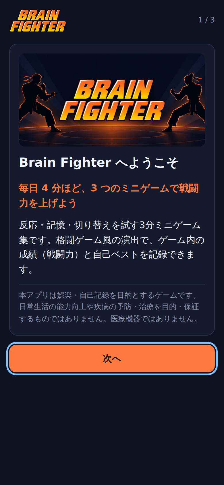<br>初回の案内（3 画面の 1 枚目）</td>
    <td align="center">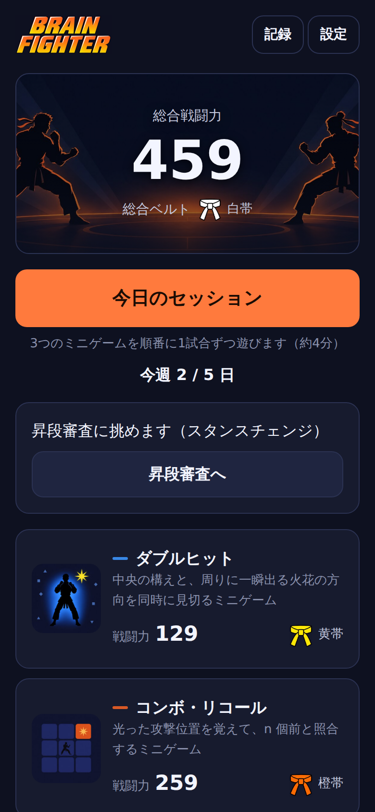<br>ホーム</td>
    <td align="center">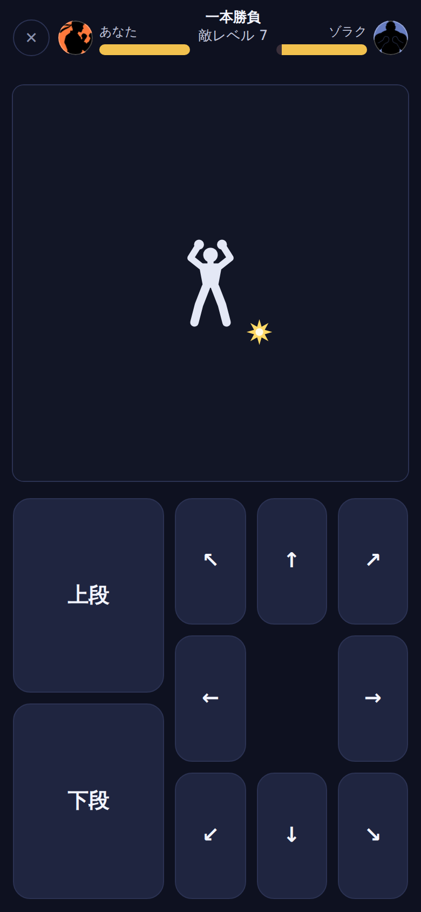<br>ダブルヒット（刺激の提示中）</td>
  </tr>
  <tr>
    <td align="center">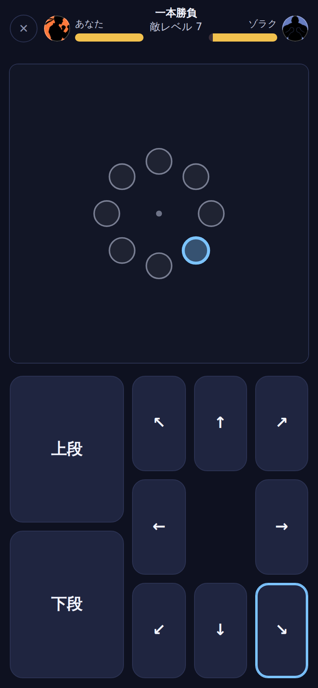<br>ダブルヒット（応答画面）</td>
    <td align="center">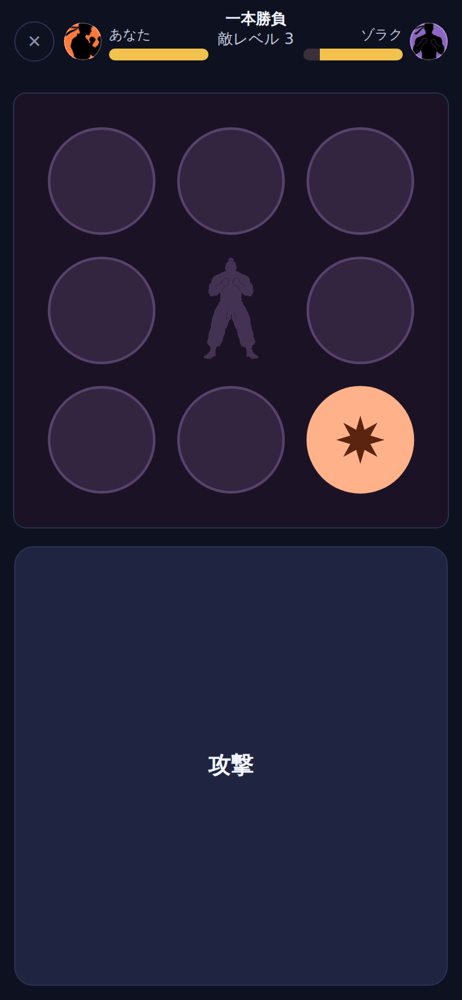<br>コンボ・リコール（点灯中）</td>
    <td align="center">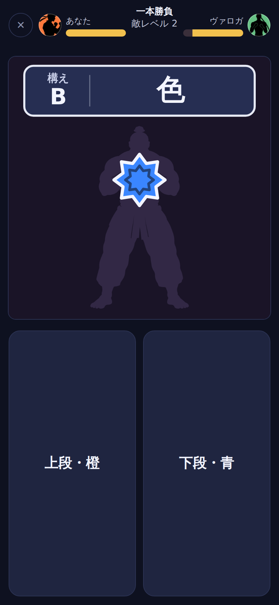<br>スタンスチェンジ（構え＋攻撃アイコン）</td>
  </tr>
  <tr>
    <td align="center">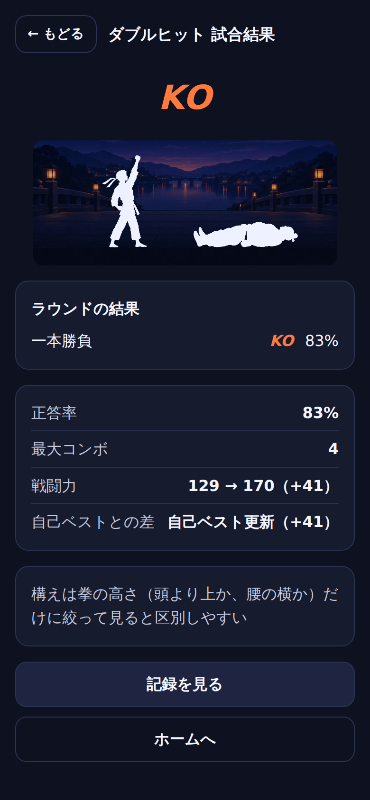<br>結果画面（KO）</td>
    <td align="center">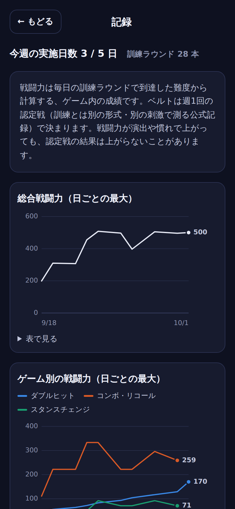<br>記録（戦闘力）</td>
    <td align="center">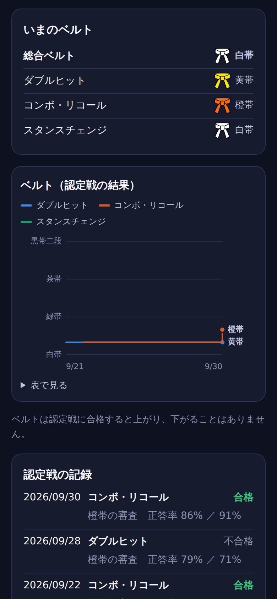<br>記録（ベルト＝認定戦の別グラフ）</td>
  </tr>
  <tr>
    <td align="center">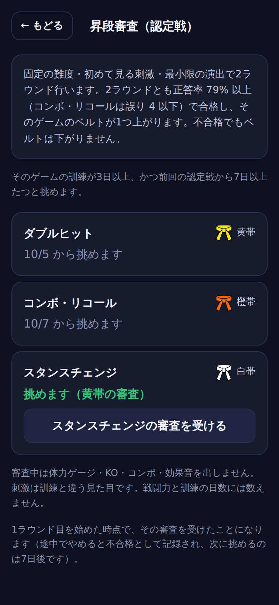<br>昇段審査（説明と選択）</td>
    <td align="center">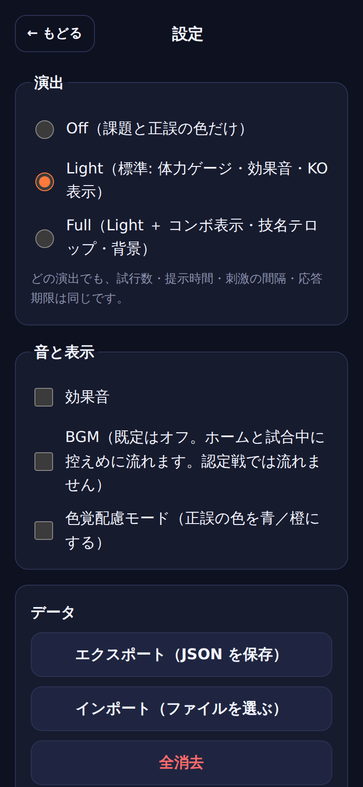<br>設定</td>
    <td align="center">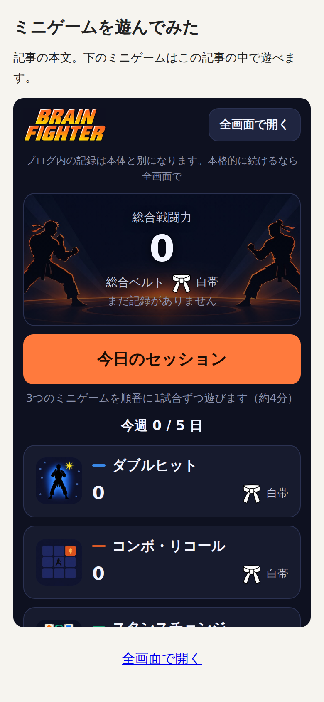<br>ブログ記事に埋め込んだところ</td>
  </tr>
</table>

## 遊び方

1. 初めて開くと 3 画面の案内が出る（アプリの説明と免責 → あそび方 → 演出の選択。既定は Light）。
2. ホームの「今日のセッション」で、3 つのミニゲームを 1 試合（1 ラウンド）ずつ順番に遊ぶ（約 4 分。順番は日替わり。仕様書 v1.2）。
   試合の後は結果画面で止まり、「次のゲームへ」で進む（自動では進まない）。
3. 同じ日の 2 回目は 4 時間あけてから、1 日 2 回まで。週の目安は 3〜5 日（ホームに「今週 x / 5 日」。連続日数は数えない）。
4. **難度はゲームが成績に合わせて自動で決める**（選ぶ操作は無い）。到達した難度が**戦闘力**（ゲームごとに 0〜1000、ホームの数字は 3 本の合計）になる。速さは戦闘力に入らない。
5. 訓練が 3 日以上たまると、週 1 回の**昇段審査（認定戦）**に挑める。合格するとそのゲームの**ベルト**が上がる。
6. 「記録」で戦闘力の日ごとの推移・ゲーム別の推移・ベルトの推移（別のグラフ）・ラウンドの正答率を見られる。「設定」で演出・効果音・色覚配慮・データの書き出し／読み込み／全消去。

PC ではキーボードでも遊べる（各ゲームの開始前の画面にキーの割当が出る）。

## 3 つのミニゲーム

| | ダブルヒット | コンボ・リコール | スタンスチェンジ |
|---|---|---|---|
| 課題形式 | UFOV 型（中心の識別＋周辺の定位） | 位置 n-back | 手がかり付きタスク切替 |
| 画面 | 中央の敵の「構え」（上段／下段）と、8 方向のどこかに一瞬出る「火花」（＋暗い妨害図形）。すぐ砂嵐で隠れる | 3×3 の盤で敵の「攻撃位置」が 1 つずつ光る | 上に「構え」（A 高低／B 色／C 形）、少しあとに敵の攻撃アイコン |
| 答え方 | 構えのボタンと、方向のボタン（または盤の丸をタップ）の両方。5 秒以内・順番は自由 | n 個前と同じ位置なら「攻撃」。違えば押さない | 構えの基準で左右どちらかのボタン（左 = 上段・橙・丸／右 = 下段・青・角）。期限内に |
| 難度（アルゴリズムだけが決める） | 提示時間 T（33〜500 ms。正答で ×0.93、誤答で ×1.25）と、妨害の数などのステージ 0〜4 | n（1〜9。ラウンドの誤りが 3 未満で +1、5 超で −1） | ステップ 1〜20（応答期限・手がかりから刺激までの間隔・ルール数。正答率 90% 以上で +1、75% 未満で −1） |
| 1 試合（1 ラウンド） | 24 試行（約 90 秒） | (20 + n) 試行（約 55〜75 秒） | 16 試行（約 30〜40 秒。ウォームアップ無し） |
| PC キー | 構え Q / A（/ Z）、方向 テンキー・矢印など | スペース | ← / →（F / J） |
| 詳しい設計 | [`src/games/double-hit/README.md`](src/games/double-hit/README.md) | [`src/games/combo-recall/README.md`](src/games/combo-recall/README.md) | [`src/games/stance-change/README.md`](src/games/stance-change/README.md) |

どのゲームも、正誤は刺激の外（上帯）に 1 ビット（○／× の形と色、短い音）で出る。刺激は抽象的な図形で、実在の格闘ゲームの技やキャラクターは使っていない。

## 昇段審査（認定戦）

仕様書 第7節。訓練（毎日の戦闘力）とは別の「公式記録」で、段位（ベルト）を決める。

- **挑める条件**: そのゲームの訓練が 3 日以上、かつ前回の認定戦から 7 日以上。ホームに「昇段審査に挑めます（ゲーム名）」と出る。
- **選ぶ**: `#/cert` で挑めるゲームを1つずつ、または「まとめて受ける」で続けて受けられる（難度は選べない）。
- **内容**: 「現在のベルト + 1」のティア（各ゲームの `certParams`）の**固定難度**で、**訓練と別の見た目の刺激**（`untrained: true`）を 2 ラウンド。1 ラウンドの試行数は訓練と同じ。
  固定難度は `src/cert/runner.ts`: 試行列は `createRound`、ラウンドは `RoundRunner` を `adaptive: false` で動かすだけで、`adapt` / `adaptTrial` / `power` を呼ばない。
- **合格**: 2 ラウンドとも正答率 79% 以上（ゲームごとの `certRoundPassed`。コンボ・リコールは誤り 4 以下）。合格でベルト +1、不合格でもベルトは下がらない。
- **演出は最小**: HP バー・KO・コンボ・効果音・ファイター・背景なし（正誤の 1 ビットだけ）。結果は「合格／不合格」と正答率だけ。
- **記録**: `SaveData.certs`（訓練とは別のテーブル）。訓練のラウンド・訓練日・戦闘力には数えない。1ラウンド目を始めた時点で記録を作るので、途中でやめると「不合格（中断）」として残り、次は 7 日後（開始前の「やめる」なら記録しない）。
- **ベルト**: 0 白帯・1 黄帯・2 橙帯・3 緑帯・4 青帯・5 紫帯・6 茶帯・7 赤帯・8 黒帯・9 黒帯二段。総合ベルト＝3本の最低値。ホームと記録画面に表示し、記録画面では戦闘力とは別のグラフと「認定戦の記録」に出す。

## 演出プリセット（Off / Light / Full）

仕様書 第9節。設定画面（と初回の案内）で選ぶ。既定は Light。**どのプリセットでも試行数・提示時間・刺激間隔・応答期限・標的比率は同じ**で、演出はラウンド実行のイベントを購読するか、ラウンドの外（結果画面）に出るだけ。

| | Off | Light（既定） | Full |
|---|---|---|---|
| 課題中 | 課題と正誤の 1 ビットだけ | ＋静的な HP バー（自キャラ・敵キャラのアバター付き）・短い正誤音・ラウンド開始の合図（スタート直後） | ＋コンボ表示・静的なカスタム背景（ステージの画像を画面全体に。刺激領域は不透明なので重ならない） |
| 結果画面（1 試合 1 ラウンドなので、ここがラウンド末。ラウンドは「一本勝負」） | 成績だけ | ＋KO / PERFECT の見出し・静止画のファイター（ステージ背景の上のシルエット）・KO / PERFECT / 判定の音（勝ちならそのあとファンファーレ）。判定負けは「次は ◯ 問正解で KO」と情報だけ | ＋必殺演出（KO / PERFECT のとき、約 1.6 秒だけ動いて止まる）と技名テロップ・衝撃音（→ KO / PERFECT の音 → ファンファーレ） |

- KO してもラウンドは最後まで続く（体力が 0 になっても「ダウン」と出るだけ）。
- 訓練は 1 試合 1 ラウンド（仕様書 v1.2）なのでラウンド間の画面は無い。認定戦の 2 ラウンドの間だけ、演出なしの 10 秒の画面（「次のラウンドへ」で進める）が出る。
- 使わない演出: 低 HP の点滅・警報音、画面揺れ、フラッシュ、ヒットストップ、スロー、刺激の近くで動くもの。点滅は 3 回/秒以下。
- 音は最初のタップ・キー操作まで鳴らさない（埋め込み時の自動再生制限にも合う）。設定で効果音と BGM をそれぞれオン／オフにできる（BGM は既定オフ）。
- 「視差を減らす」設定（prefers-reduced-motion）では、動く演出を静止画にする。

## 音（効果音・BGM）

効果音と BGM は Genspark CLI（`../genspark-audio/gen.sh`。効果音 = ElevenLabs Sound Effects、BGM = ElevenLabs Music の歌なし）で生成した音から作っている。

- 元の音とプロンプト: `audio-src/raw/` と `audio-src/PROMPTS.md`。加工: `npm run audio`（`scripts/audio/process.mjs`。ffmpeg が要る）→ `public/audio/`・`src/skin/audio-manifest.ts`。
- 効果音（Light / Full で効果音がオンのとき）: 正誤の 1 ビット（90 ms の小さな音。課題中に鳴るのはこれだけ）、ラウンド開始の合図、KO / PERFECT / 判定、必殺演出の衝撃、結果画面のファンファーレ。認定戦では鳴らさない。効果音が読み込めない環境では、正誤音と衝撃音だけ発振器の音で代用する。
- BGM（設定でオン。既定オフ）: ホームなどのメニューでは「メニュー」の曲、試合中は「試合」の曲を小さめに。演出 Off の試合中と認定戦では鳴らさない。タブが隠れると止まる。曲の末尾と先頭を 1.5 秒重ねてループする。
- 効果音は Service Worker がプリキャッシュする。BGM（1 曲 1MB 前後）は最初に鳴らしたときにキャッシュする。

## 画像素材（生成画像）

ロゴ・キービジュアル・ファイターのシルエット・ステージ背景・ゲームカードのサムネイル・ベルト・アプリアイコンは、GPT Image 2.5（Genspark CLI。`../genspark-image/gen.sh`）で生成した画像から作っている。他者の素材は使っていない。

- 元画像とプロンプト: `art-src/raw/` と `art-src/PROMPTS.md`。加工: `npm run art`（`scripts/art/process.mjs`。ImageMagick 6 が要る）→ `public/art/`・`public/icons/`・`src/skin/art-manifest.ts`。
- 使う場所: ホーム（ロゴ・キービジュアルの上に総合戦闘力・サムネイル・ベルト）、初回の案内、上帯のアバター、結果画面のファイター、Full の静的な背景、コンボ・リコールの中央の敵とスタンスチェンジの薄い敵（どちらも盤の一部の静止画）、アプリアイコン。
- 刺激そのもの（構え・火花・妨害・マスク・点灯マス・攻撃アイコン・構えのプレート）は図形のまま。画像の有無で提示時間・大きさ・色・コントラストは変わらない。
- 刺激領域で使う画像は、ラウンドの開始時に読み込み済みのものに固定する（途中で見た目が変わらない）。画像が読めない環境ではすべて図形の描画に戻る。
- ファイターは黒一色＋アルファのシルエットなので、使う場所の色に染めて描く。ステージ背景は敵レベルから決定的に選ぶ（道場・街・山・橋）。画像は Service Worker がプリキャッシュするのでオフラインでも同じ見た目。

## ブログに埋め込む（WordPress）

自己ホストの WordPress の記事に「カスタム HTML」ブロックを足し、次のコードを貼る（アプリの「設定 → ブログに埋め込む → ブログ用の埋め込みコードをコピー」でも同じものをコピーできる）。

```html
<div style="max-width:420px;margin:0 auto;aspect-ratio:9/16;">
  <iframe src="https://sachi0202are-lab.github.io/brain-fighter/embed/"
          style="width:100%;height:100%;border:0;border-radius:12px;"
          allow="fullscreen" loading="lazy" title="Brain Fighter"></iframe>
</div>
<p style="text-align:center"><a href="https://sachi0202are-lab.github.io/brain-fighter/" target="_blank" rel="noopener">全画面で開く</a></p>
```

- 埋め込み版（`/brain-fighter/embed/`）はナビ（記録・設定）を省いたコンパクト版で、「全画面で開く」（本体を新しいタブで）と「ブログ内の記録は本体と別になります。本格的に続けるなら全画面で」を出す。iframe の中の保存領域は本体と別になる。
- 埋め込み版には PWA の manifest と Service Worker の登録を入れない（ホーム画面への追加は本体でだけ案内する）。本体の Service Worker は `/embed/` を本体のページに置き換えない（オフラインでも埋め込み版が開く）。
- `X-Frame-Options` や `frame-ancestors` は設定しない（GitHub Pages も付けない）。
- WordPress.com の無料〜一部のプランでは iframe が使えない。その場合は「全画面で開く」のリンクだけを貼る。

## 開発

Node 22 / npm。依存は Vite・TypeScript・Vitest・vite-plugin-pwa・Playwright（と `@types/node`）だけ。

| コマンド | 内容 |
|---|---|
| `npm install` | 依存を入れる |
| `npm run dev` | 開発サーバー → http://localhost:5173/brain-fighter/ （ポート指定: `npm run dev -- --port 5174 --strictPort`） |
| `npm run build` | 型チェック（`tsc`）＋本番ビルド → `dist/` |
| `npm run preview` | ビルド結果を配信 → http://localhost:4173/brain-fighter/ と http://localhost:4173/brain-fighter/embed/ （`npm run preview -- --port 4178`） |
| `npm test` | ユニットテスト（Vitest。`src/**/*.test.ts`） |
| `npm run test:watch` | ユニットテストの監視実行 |
| `npm run test:e2e` | E2E（Playwright。モバイル 390×844 と PC 1280×800）。ビルドして `vite preview` で配信してから走る |
| `npm run lint:words` | 文言チェック（仕様書 第12節の「使わない語」を `src/` `public/` `embed/` `README.md` などから探す） |
| `npm run typecheck` | 型チェックだけ |
| `npm run art` | 生成画像（`art-src/raw/`）からアプリの画像素材（`public/art/`・`public/icons/`・`src/skin/art-manifest.ts`）を作り直す（ImageMagick 6 が要る）。`npm run icons` はアイコンだけ |
| `npm run audio` | 生成した音（`audio-src/raw/`）から効果音と BGM（`public/audio/`・`src/skin/audio-manifest.ts`）を作り直す（ffmpeg が要る） |
| `npm run screenshots` | README のスクリーンショット（`docs/screenshots/`）を撮り直す（先に `npm run build`） |

### URL パラメータ

| パラメータ | 内容 |
|---|---|
| `?seed=123` | 乱数シードを固定（ラウンドごとのシードは「シード・ゲーム・ラウンド番号」から決まる） |
| `?test=1` | テスト用フック `window.__bfTest` を出す（正解の取得・入力・自動プレイ・ログ・演出の点検・フレームの計測） |
| `?test=1&fx=off` | 演出プリセットを一時的に上書き（`off` / `light` / `full`。テスト用） |
| `?test=1&onboarding=1` | `?test=1` のときも初回の案内を出す（`?test=1` だけなら出さない） |

例: `http://localhost:5173/brain-fighter/?test=1&seed=1#/play/double-hit`
埋め込み版: `http://localhost:5173/brain-fighter/embed/`（`?test=1` なども同じように使える）

### 画面（ハッシュルーティング）

`#/` ホーム（初回は案内）／ `#/play/:gameId` ゲーム ／ `#/result` 結果 ／ `#/records` 記録 ／ `#/cert` 認定戦（昇段審査）を選ぶ ／ `#/cert/run/:gameId[,:gameId…]` 認定戦の実施 ／ `#/settings` 設定 ／ `#/welcome` 初回の案内

別ページ: `/brain-fighter/embed/`（ブログ埋め込み用のコンパクト版。同じアプリを埋め込み表示で起動する）

### 構成

```
src/
  engine/            共通エンジン（ゲームに依存しない。純粋関数＋テスト）
    types.ts         GameModule インターフェース（各ゲームが実装する）
    round.ts         ラウンド実行のステートマシン（試行の提示・入力・判定・記録。演出はイベントを購読するだけ）
    match.ts         1試合の進行（ラウンド × roundsPerMatch。既定 1、認定戦は 2。ウォームアップ・追加ラウンドの仕組みは残してある）
    timing.ts        rAF スケジューラ、フレームへの量子化（33 ms 以下は切り上げ）、テスト用の仮想時計
    staircase.ts     階段法（重み付き・ブロックしきい値・n-back・N-down/1-up）
    power.ts         戦闘力（一般式・ダブルヒットの式・合計）
    session.ts       1日のセッション（日替わり順・4時間・1日2回・今週 x/5 日・認定戦の解放条件）
    rng.ts / sequence.ts / records.ts / headless.ts / autoplay.ts / stats.ts / dates.ts / events.ts / ids.ts
  cert/              認定戦（昇段審査）: 解放条件・ティア・合否・記録（cert.ts）、固定難度で 2 ラウンド行う実行（runner.ts）
  storage/           localStorage（キー brain-fighter.v1）、スキーマと移行、エクスポート／インポート、集計
  skin/              演出（off / light / full）: HP バー、1 ビットフィードバック、KO / PERFECT / 判定、シルエット、
                     必殺演出（special.ts）、Full の静的な背景（backdrop.ts）、効果音と BGM（sound.ts。一覧は生成物の audio-manifest.ts）、
                     画像素材の読み込みと描画（art.ts。一覧と寸法は生成物の art-manifest.ts）
  ui/                画面（DOM）。screens/ に各画面、stage.ts は訓練と認定戦で共用する「舞台」（刺激領域・応答ボタン・キー）、
                     charts.ts は記録画面のグラフ（SVG 自前描画）、embed-main.ts / embed-code.ts はブログ埋め込み、test-hooks.ts は ?test=1 のフック
  games/             index.ts（登録簿）と double-hit/ combo-recall/ stance-change/（各ゲームと、その README）
  i18n/              ja.ts（入口）、ja/common.ts（共通の文言）、ja/<game-id>.ts（ゲームごとの文言）
  test/              テスト用の小道具（Canvas・ストレージ・DOM の代用品、テスト用ゲーム）
embed/index.html     ブログ埋め込み用ページ（Vite の2つ目の入口 → /brain-fighter/embed/）
e2e/                 Playwright（下の表）。embed-parent.html はブログ記事の代わりの親ページ（第11節のコードそのまま）
scripts/             lint-words.mjs（文言チェック）、art/process.mjs（画像素材の加工とアイコン生成）、audio/process.mjs（音の加工）、screenshots.mjs（スクリーンショット）
public/              favicon とアプリアイコン、画像素材（art/: ファイターのシルエット・ステージ背景・ロゴ・キービジュアル・サムネイル・ベルト）、音（audio/: 効果音と BGM）
art-src/             生成画像の元データ（raw/）とプロンプト（PROMPTS.md）
audio-src/           生成した音の元データ（raw/）とプロンプト（PROMPTS.md）
docs/screenshots/    README のスクリーンショット
.github/workflows/   deploy.yml（GitHub Pages へのデプロイ）
```

大事な決まり（仕様書の MUST / MUST NOT から）

- 難度はアルゴリズムだけが決める。難度の選択・補助・スキップの操作は作らない。
- 演出プリセット（off / light / full）で試行数・提示時間・刺激間隔・応答期限・標的比率は変わらない。ゲームモジュールには演出の情報が渡らず、演出はラウンド実行のイベントを購読するだけ。
- 戦闘力に速さは入らない（`power()` には反応時間を含まない成績だけが渡る）。
- 文言は「ゲーム内の成績・記録」を主語にする（`npm run lint:words`）。
- 刺激の提示中に刺激領域の中・周りで動く演出は置かない。点滅は 3 回/秒以下。
- ゲームを直すときは `src/games/<id>/` と `src/i18n/ja/<id>.ts` の中で完結させ、共有部分（engine / ui / skin）の変更は `DESIGN_NOTES.md` に書く。

## テスト

### ユニットテスト（`npm test`）

Vitest（Node 環境・jsdom なし）。階段法・戦闘力・保存・セッション・認定戦・演出の同値性（仮想時計で実測まで一致）・演出の安全性（点滅・CSS）・各ゲームの系列と判定・画面の文言。

### E2E（`npm run test:e2e`）

本番と同じビルドを `vite preview` で配信し、モバイル（390×844）と PC（1280×800）の 2 プロジェクトで走る。

```bash
npm run build
PORT=4177 npx playwright test --workers=1      # いちばん正確（提示時間の照合が負荷で揺れない）。全体で 45 分前後
PORT=4177 npx playwright test                  # 設定の既定は同時 2 本（30 分前後）
PORT=4177 npx playwright test smoke.spec.ts    # 1 ファイルだけ
```

- ビルド出力は `.e2e-dist/<PORT>/`、結果は `test-results/<PORT>/` に分かれる。ほかの E2E やスクリーンショットと**同時に走らせない**（負荷で提示時間の照合 ±1 フレームが落ちることがある）。
- Playwright 同梱のブラウザが無い環境では `/opt/pw-browsers/chromium`（または環境変数 `PW_CHROMIUM_PATH`）を使う。
- 長い試合を通すテストは個別に 10〜20 分のタイムアウト。スモークは本実装の試行数で 1 プロジェクト約 8 分（2 プロジェクトで約 16 分）かかる。

| spec | 内容 |
|---|---|
| `smoke.spec.ts` | ホーム → 今日のセッション → 3 ゲームを最後まで（正答率 80% の疑似プレイヤー）→ 結果 → 記録 → 再読み込み。あわせて提示時間の実測誤差（±1 フレーム）・ラウンド中の fps・刺激提示中の演出の点検・難度の操作が無いこと |
| `fx-equivalence.spec.ts` | 3 ゲームそれぞれ、off / light / full を同じシード・同じ入力で遊び、試行数・各フェーズの予定時間・刺激・正誤・難度・戦闘力が一致 |
| `fx-presets.spec.ts` | Off / Light / Full の見え方、KO してもラウンドが続く、刺激提示中に動く・重なる演出が無い、正誤表示は 3 回/秒以下、出荷した CSS の点検 |
| `cert.spec.ts` | 認定戦の解放条件・固定難度・合格でベルト +1・不合格で変化なし・まとめて受ける・中断・刺激領域のタップ |
| `embed.spec.ts` | ブログ記事（別オリジン）の iframe で埋め込み版が動く・全画面で開く・最初のタップまで音を準備しない・ヘッダ・オフライン・埋め込みコードのコピー |
| `onboarding.spec.ts` | 初回の 3 画面・演出の選択・免責文、エクスポート → 全消去 → インポートで完全に戻る |
| `pwa.spec.ts` | manifest とアイコン・Chromium のインストール可能性の判定・Service Worker・オフラインで起動して遊べる・ベースパス `/brain-fighter/` |
| `robustness.spec.ts` | localStorage が使えなくても起動・全画面で難度／補助／スキップの操作が無い・免責文・1 試合 1 ラウンドで結果画面へ |

### 受け入れ基準（仕様書 第13節）との対応

| # | 基準 | 自動テスト |
|---|---|---|
| 1 | 演出 3 種でログが一致 | `src/engine/fx-equivalence.test.ts`・各ゲームの `match.test.ts`（仮想時計で実測まで）、`e2e/fx-equivalence.spec.ts` |
| 2 | 難度選択が無い | `e2e/robustness.spec.ts`・`e2e/smoke.spec.ts`（結果画面）、`src/i18n/ja.test.ts`（全文言） |
| 3 | 階段法 | `src/engine/staircase.test.ts`・`src/games/*/`（`params` / `ladder` / `game` の各テスト） |
| 4 | スコア（速さ非依存） | `src/engine/power.test.ts`・`src/games/contract.test.ts`・各ゲームのテスト |
| 5 | 保存・復元 | `src/storage/storage.test.ts`、`e2e/onboarding.spec.ts`（書き出し → 全消去 → 読み込み）、`e2e/robustness.spec.ts`、`e2e/smoke.spec.ts`（再読み込み） |
| 6 | 認定戦 | `src/cert/cert.test.ts`、`e2e/cert.spec.ts` |
| 7 | スモーク | `e2e/smoke.spec.ts` |
| 8 | 点滅・刺激中の演出 | `src/skin/effects.test.ts`、`e2e/fx-presets.spec.ts`、`e2e/smoke.spec.ts` |
| 9 | 文言 | `npm run lint:words` |
| 10 | PWA | `e2e/pwa.spec.ts`、`e2e/embed.spec.ts`（オフライン） |
| 11 | 公開・埋め込み | `e2e/embed.spec.ts`・`e2e/pwa.spec.ts`（`vite preview` で `/brain-fighter/` と `/brain-fighter/embed/`）。GitHub Pages 上の確認は公開後に手で |
| 12 | 性能 | `e2e/smoke.spec.ts`（提示時間の実測誤差 ±1 フレーム・ラウンド中の fps） |

## 公開（GitHub Pages）

`.github/workflows/deploy.yml` は、`main` への push（または手動実行）で 文言チェック → ユニットテスト → ビルド → GitHub Pages へ公開 を行う。

GitHub Actions はリポジトリの**いちばん上**の `.github/workflows/` しか読まないので、このフォルダが `cloud-workspace` の中にある間はワークフローは動かない。**`sachi0202are-lab/brain-fighter` に切り出したときに動く。**

1. GitHub の `sachi0202are-lab/brain-fighter`（公開リポジトリ。作成済み）に、このフォルダ（`brain-fighter/`）の中身をルートに置いて `main` に push する（`.github/` を含める。`node_modules/` `dist/` `.e2e-dist/` `test-results/` は `.gitignore` 済み）。
   `cloud-workspace` で作業した内容を反映するときは、公開リポジトリのクローンの中で次のように丸ごと上書きしてコミットする:

   ```sh
   # <cloud-workspace> は cloud-workspace リポジトリのクローン、<pages> は brain-fighter リポジトリのクローン
   tar -C <cloud-workspace>/brain-fighter --exclude=./.git --exclude=./node_modules --exclude=./dist --exclude=./.e2e-dist --exclude=./test-results -cf - . | tar -C <pages> -xf -
   cd <pages> && git add -A && git commit -m "cloud-workspace の作業を反映" && git push origin main
   ```

2. 初回だけ: リポジトリの Settings → Pages → Build and deployment → Source を「GitHub Actions」にする（ワークフローの `enablement: true` でも有効になる）。
3. Actions の「Deploy to GitHub Pages」が緑になったら、https://sachi0202are-lab.github.io/brain-fighter/ と https://sachi0202are-lab.github.io/brain-fighter/embed/ を開いて確かめる（オフラインで開けるか、iframe で埋め込めるかも）。設定画面の「バージョン」のビルド ID が新しいコミットになっていれば反映済み。

- ベースパスは `/brain-fighter/`（`vite.config.ts` の `base` と manifest の `start_url` / `scope` / `id`、`src/ui/embed-code.ts` の URL）。リポジトリ名を変えるときはこの 3 か所を合わせる。
- E2E はブラウザの準備に時間がかかるのでワークフローに入れていない。公開前に手元で `npm run test:e2e` を回す。
- 更新の取り込み: 公開後に開くと新しい Service Worker が裏で入り、試合中でなければ一度だけ自動で再読み込みして最新になる（`src/main.ts`）。設定画面の「バージョン」に出るビルド ID（日付＋コミット）で、配信中の版を見分けられる。
